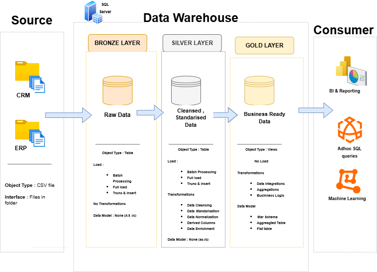

# Data Warehouse and Analytics Project (SQL Server)

## Overview

This project demonstrates the end-to-end design and implementation of a modern data warehouse using SQL Server. It covers the full pipeline—from ingesting raw data to building a dimensional model and generating business-ready insights.

The objective is to create a clean, scalable, and query-efficient system that supports reporting and data-driven decision-making.

---

## Architecture

The solution follows a **Medallion Architecture** pattern:

* **Bronze Layer (Raw)** – Ingest data as-is from source systems with no transformations
* **Silver Layer (Cleaned)** – Perform Data cleansing ,standardization, normalization and enrichment
* **Gold Layer (Business-ready)** – Apply business logic, aggregation and create analytical models (facts & dimension tables)

  
### Architecture Diagram



---

## Data Flow

1. Extract data from source systems (CRM and ERP) provided as CSV files
2. Load raw data into staging tables (Bronze layer)
3. Clean, standardize, and transform data (Silver layer)
4. Build dimensional models (fact & dimension tables) in the Gold layer
5. Query the model to generate insights for reporting and analysis

---

## Data Engineering (Warehouse Development)

### Objective

Design a SQL Server-based data warehouse to consolidate multiple data sources into a unified analytical model.

### Key Activities

* Data ingestion from CSV files (ERP, CRM)
* Data quality checks (nulls, duplicates, formats)
* Transformations and standardization
* Dimensional modeling (star schema)
* Performance-aware table design and indexing (where applicable)

---

## Data Analytics (BI & Reporting)

### Objective

Use SQL to derive insights that support business decisions:

* **Customer behavior** (segmentation, activity)
* **Product performance** (top products, categories)
* **Sales trends** (time-based analysis)

---

## Tech Stack

* SQL Server
* T-SQL
* CSV files (source data)
* Dimensional Modeling (Star Schema)
* draw.io (for architecture diagram)

---

## Project Structure

```
/staging        → Raw data ingestion (Bronze layer )
/etl            → Transformation logic (Silver layer)
/data_model     → Fact & dimension tables (Gold layer)
/analytics      → SQL queries for insights
/docs           → Architecture diagram & documentation
```

---

## Key Learnings

* End-to-end data warehouse design using SQL Server
* Practical ETL development and data quality handling
* Dimensional modeling (fact/dimension tables)
* Writing analytical SQL for business insights
* Structuring a project for clarity and reproducibility

---

## Acknowledgment

This project is part of my learning journey in data engineering.
Concepts and guidance were followed from  mentor Baraa Khatib Salkini aka Data With Baraa.
All implementations, documentation, and understanding are my own.

---

## About Me

Hi, I’m Sakshi Salunke.

I’m building hands-on expertise in data analytics and data engineering, focusing on SQL, ETL processes, and data warehouse design. I enjoy working on real-world datasets and creating structured systems that turn data into meaningful insights.

---

## License

This project is licensed under the MIT License.


